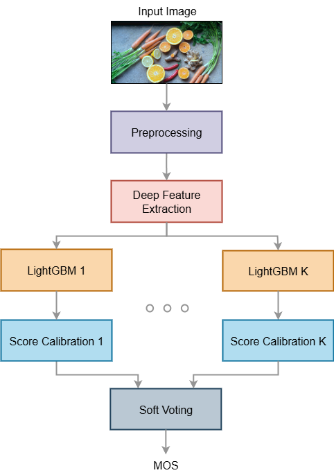

<p align="center">
  
</p>

# Ensembling Deep Features with LightGBM for Perceptual Quality Assessment of Filtered Images
The increasingly popular use of aesthetic filters on social media has introduced new challenges in the field of Image Quality Assessment (IQA), as traditional distortion-based metrics are not designed to capture the subjective and content-aware nature of filter-based enhancements.

This work presents a no-reference IQA method that combines deep feature extraction with gradient-boosted decision trees to assess the perceptual quality of filtered images. Specifically, the proposed model employs three pre-trained deep learning networks to extract an image feature vector, which is fed into an ensemble of eight [LightGBM](https://lightgbm.readthedocs.io/en/latest/index.html) models. The final Mean Opinion Score (MOS) prediction is obtained by averaging the outputs of these individual models.

Ranked 3rd in the [Image Manipulation Quality Assessment Challenge](https://jiangliu5.github.io/imqac.github.io/) at the International Conference on Visual Communication and Image Processing (VCIP) 2025, the proposed method outperforms the baseline across all metrics, achieving a Pearson Linear Correlation Coefficient (PLCC) of 0.847 vs. 0.543, a Spearman Rank-Order Correlation Coefficient (SROCC) of 0.839 vs. 0.516, and a Root Mean Squared Error (RMSE) of 0.076 vs. 0.121.

## Paper

The paper describing the proposed method has been accepted for presentation at VCIP 2025.

You can access the camera-ready version here: [LightGBM_Ensemble_IQA_CameraReady.pdf](paper/LightGBM_Ensemble_IQA_CameraReady.pdf).

## Project Setup

### 1. Clone Repository

Clone this repository to your local machine:

```bash
git clone https://github.com/sergio-sanz-rodriguez/LightGBM-Ensemble-IQA.git
```

Move into the project directory:

```bash
cd LightGBM-Ensemble-IQA
```

(Optional) If you already cloned it before and want to get the latest updates:

```bash
git pull
```

### 2. Download Dataset

The image dataset and the baseline model can be downloaded from the [Image Manipulation Quality Assessment Challenge (IMQAC) website](https://jiangliu5.github.io/imqac.github.io/).

Once the ZIP file has been downloaded, unzip it and move its contents into the project directory.  

After extraction, your repository should have the following structure:

```
LightGBM-Ensemble-IQA/
├── images/
├── models/
├── paper/
├── trained_3072to128/
├── trained_3072to128_weights/
├── utils/
└── VCIP_IMQA/
    └── VCIP/
        ├── EQ420_image/    
        |   ├── img1.png
        |   ├── img2.png
        |   └── ...
        ├── IMQA/
        └── Labels/    
```

## Environment Setup (Windows)

Follow these steps to create and configure a clean Python virtual environment (.venv).

### 1. Install Python 3.11

#### Option A – Using winget (recommended)

```bash
winget install -e --id Python.Python.3.11
```

#### Option B – Manual Download

Download the Windows Installer (64-bit) from `python.org/downloads/release/python-3110`.

During setup, make sure to check:

- Add python.exe to PATH

- Install launcher for all users

### 2. Verify the Installation

```bash
py --version
```

### 3. Create the Virtual Environment

Go to the project folder and create the environment:

```bash
py -3.11 -m venv .venv
```

### 4. Activate the Environment

#### PowerShell

```bash
.\.venv\Scripts\Activate.ps1
```

If you see an error about script execution being disabled, run once:

```bash
Set-ExecutionPolicy RemoteSigned -Scope CurrentUser
```

#### Git Bash

```bash
source .venv/Scripts/activate
```

### 5. Upgrade Build Tools

```bash
python -m pip install -U pip setuptools wheel
```

### 6. Install PyTorch (Choose One)

#### GPU (CUDA 12.1)

```bash
pip install --index-url https://download.pytorch.org/whl/cu121 torch==2.5.1 torchvision==0.20.1
```

### CPU-Only

```bash
pip install --index-url https://download.pytorch.org/whl/cpu torch==2.5.1 torchvision==0.20.1
```

### 7. Install Dependencies

Ensure binary wheels for heavy packages:

```bash
pip install --only-binary=:all: numpy==1.26.4 matplotlib==3.10.7
```

Then install all requirements:

```bash
pip install -r requirements.txt
```

### 8. Verify Installation

PyTorch + CUDA check:

```bash
python -c "import torch; print(torch.__version__, '| CUDA available:', torch.cuda.is_available(), '| Device:', torch.cuda.get_device_name(0) if torch.cuda.is_available() else 'CPU')"
```

Import all required files:

```bash
python -c "import numpy, matplotlib, einops, pandas, scipy, timm, torch, torchvision, tqdm, visdom, joblib, optuna, sklearn, lightgbm, memory_profiler, cv2, skimage, torchinfo; print('All good! All libraries imported successfully.')"
```

### 9. (Optional) Register the Environment for VS Code Jupyter

```bash
python -m pip install -U ipykernel jupyter ipywidgets
```
```bash
python -m ipykernel install --user --name ".venv" --display-name "Python 3.11 (.venv)"
````


